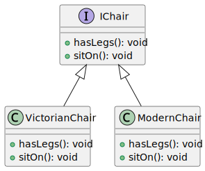
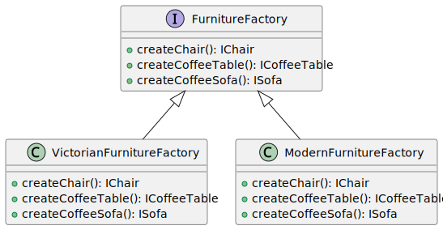

# Abstract Factory

## Introduction

Abstract Factory is a creational design pattern that lets you produce families of related objects without specifying their concrete classes.

## Problem

Imagine the furntiture simulator code consists of classes that represent:

> * A family of related products: "Chair", "Sofa" and "CoffeeTable".
>
> * Several variants of this family. For example, products "Chair", "Sofa" and "CoffeeTable" are all available in these variants: "Modern", "Victorian", "ArtDeco".

As a requirement, a means of providing the creation of individual furniture objects so that they match other objects of the same family, needs to be created.

Meanwhile the code should remain extendable to new types of furniture and styles (as in the example).

## Solution Part 1

The first thing the Abstract Factory pattern suggests is to explicitly declare interfaces for each distinct product of the product family (e.g., chair, sofa or coffee table). Then you can make all variants of products follow those interfaces. For example, all chair variants can implement the Chair interface; all coffee table variants can implement the CoffeeTable interface, and so on.

### UML Part 1

### Solution Part 2

The next move is to declare the Abstract Factory—an interface with a list of creation methods for all products that are part of the product family (for example, "createChair", "createSofa" and "createCoffeeTable"). These methods must return abstract product types represented by the interfaces we extracted previously: "Chair", "Sofa", "CoffeeTable" and so on.

### UML Part 2

